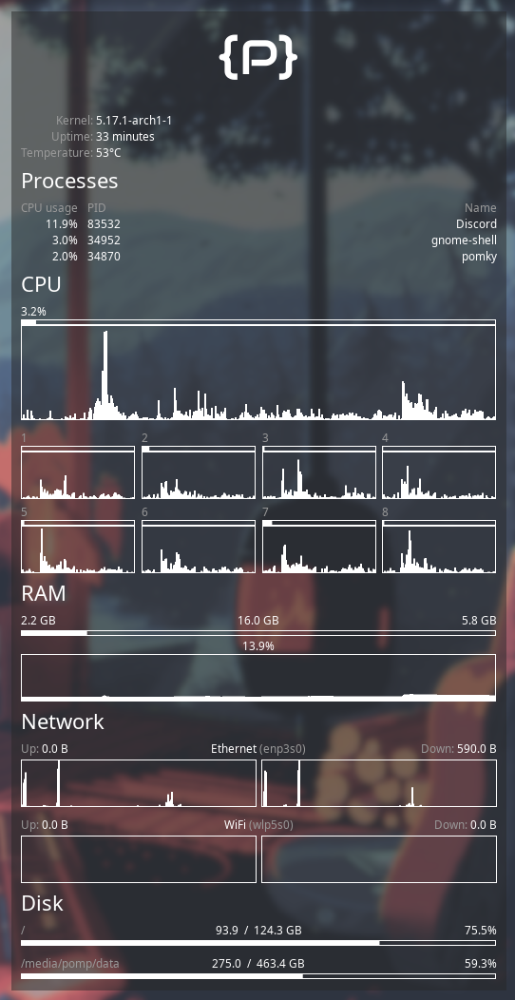

# Pomky

[](./LICENSE)

A personal conky-like Linux system monitor built with rust and gtk.

Pomky is not as configurable, modular, or feature packed as conky.
It is tailor-made for my need and hardware.
If you are looking for an conky alternative written in rust, check out
[randy](https://github.com/iphands/randy) or maybe even consider using
[eww](https://github.com/elkowar/eww).



## Requirements

- rust toolchain (recommend using rustup)
- fonts
  - [Noto Sans](https://fonts.google.com/noto/specimen/Noto+Sans)
  - [Audiowide](https://fonts.google.com/specimen/Audiowide)

## Installation

Since pomky is designed to only run on my hardware,
it will most likely not compile on your system.
No technical support will be provided.

The following command builds and saves an executable binary at
`~/.cargo/bin/pomky`.

```
cargo install --path .
```

Add the bin directory to the `PATH` environment variable
to make it available everywhere.
